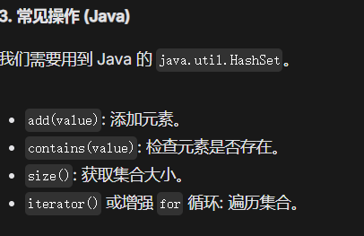

**题目链接**: [LeetCode]([url](https://leetcode.com/problems/intersection-of-two-arrays/description/))
**核心技巧**: **HashSet**

## 🧠 解题思路
1.  intersection是交集的意思
2.  HashSet判断一个元素是否在集合中（contains 操作），平均时间复杂度为 O(1)（常数时间）
3.  
4.  增强for在从集合取出时自动拆箱(unboxing), set.add时自动装箱
5.  数组与集合的转化

## ⏳ 复杂度分析
- **时间复杂度**: O(N)
- **空间复杂度**: O(1)

## 💻 代码 (Java)

```java

public class _349_IntersectionofTwoArrays {
    public int[] intersection(int[] nums1, int[] nums2) {
        HashSet<Integer> set1 = new HashSet<>();
        for (int i = 0; i < nums1.length; i++) {
            set1.add(nums1[i]);

        }
        HashSet<Integer> intersectionSet = new HashSet<>();
        for (int i = 0; i < nums2.length; i++) {
            if (set1.contains(nums2[i])) {
                intersectionSet.add(nums2[i]);
            }
        }
        int[] result = new int[intersectionSet.size()];
        int index = 0;
        for (Integer intersection : intersectionSet) {
            result[index] = intersection;
            index++;
        }
    return result;
    }
}


```